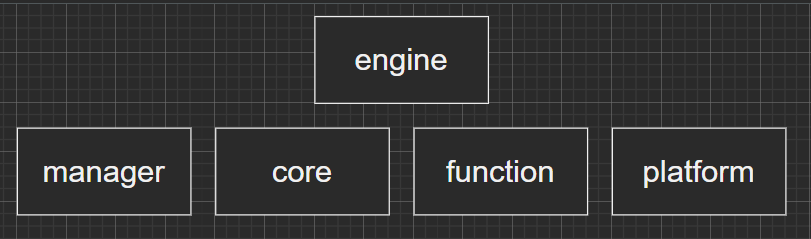

# SR_R
## *Intro*

***software-rasterization-renderer***

---



---

## *Setup*
```shell
  vcpkg install tbb:x64-windows
  vcpkg install benchmark
  vcpkg install glm
  vcpkg install rapidjson
  vcpkg install tinyobjloader
  vcpkg install openmesh
  vcpkg install spdlog
```
